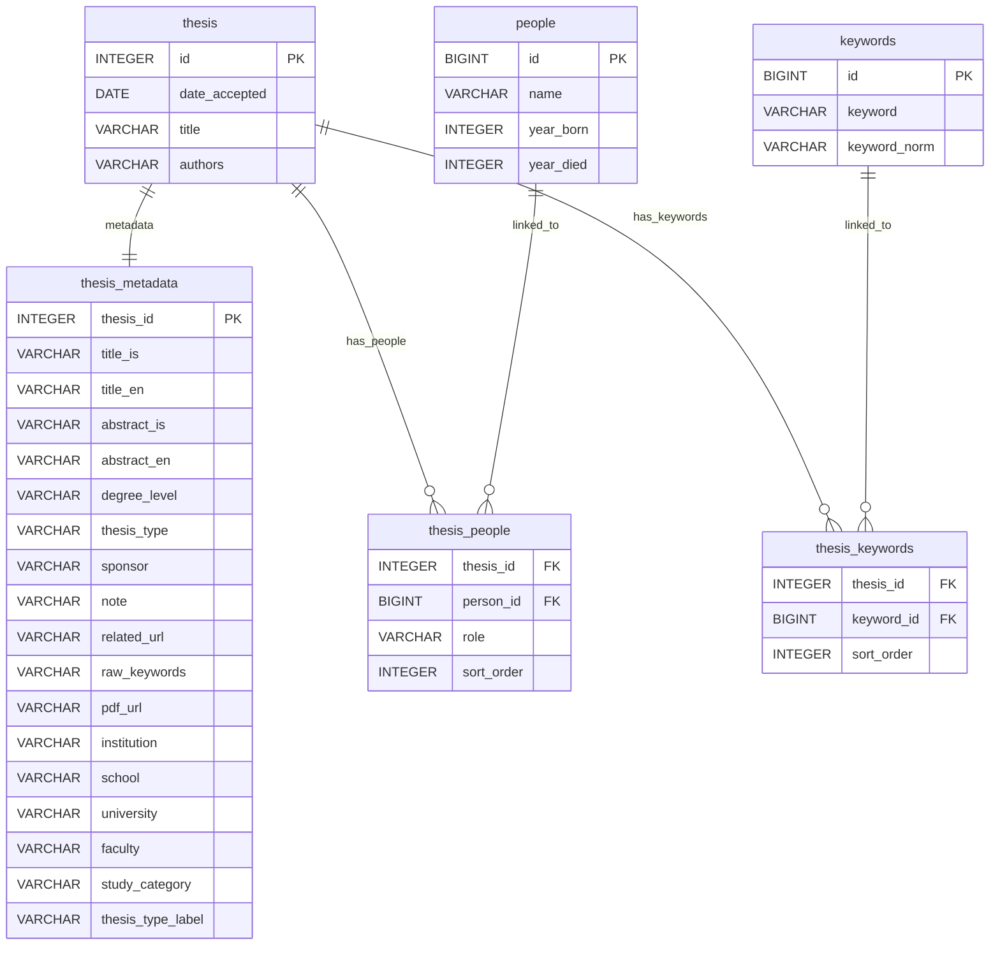

# Skemman to DuckDB Mapping

The database is populated in two passes.

## 1. Listing Capture

`skemman simple-search` builds a Skemman URL from:

- `base_url` in `config/collections.yaml`
- one collection handle, currently `1946/2064` for HI or `1946/6870` for HR
- one year from 2010 through 2026

The simple-search URL uses `dateIssued` as an exact year filter. The listing parser stores one row per search result in `thesis`.

| DuckDB column | Skemman listing source |
| --- | --- |
| `id` | item handle suffix from `/handle/1946/<id>` |
| `date_accepted` | first listing column, parsed as `DD.MM.YYYY` |
| `title` | result link text |
| `authors` | third listing column |

`v_thesis` adds the canonical item URL:

```sql
'https://skemman.is/handle/1946/' || id as item_url
```

## 2. Metadata Load

`skemman metadata-load` reads item URLs from `v_thesis` where no `thesis_metadata` row exists, unless explicit `--ids` or `--urls` are provided. The implementation lives in `src/skemman_scraper/metadata_load.py`.

For each item:

1. Resolve the thesis ID from the Skemman item URL.
2. Read `data/raw/items/<id>.html` if present.
3. Fetch the item page from Skemman if the HTML cache file is missing.
4. Save newly fetched HTML to `data/raw/items/<id>.html`.
5. Parse visible table rows, definition lists, DSpace `div.attr` blocks, and embedded `<meta>` tags.
6. Replace existing rows for that thesis in `thesis_metadata`, `thesis_people`, and `thesis_keywords`.
7. Insert normalized metadata, people links, and keyword links.

## Database Diagram



## Metadata Columns

| DuckDB column | Primary Skemman sources | Notes |
| --- | --- | --- |
| `title_is`, `title_en` | `DCTERMS.title`, `DCTERMS.alternative`, `citation_title`, `Titill`, `Title`, `dc.title` | Icelandic vs English is detected heuristically. |
| `abstract_is`, `abstract_en` | `DCTERMS.abstract`, `Útdráttur`, `Abstract`, `dc.description.abstract`, `DCTERMS.description` | Icelandic abstracts can be extracted from prefixed descriptions. |
| `degree_level` | `Námsstig`, `Degree`, `dc.description.degree`, `DCTERMS.type` | Normalized to `bachelor`, `master`, or `phd`. |
| `thesis_type` | `DCTERMS.type`, `Type`, `dc.type` | Master rows are cleaned to remove graduate diploma noise where possible. |
| `sponsor` | `Styrktaraðili`, `Sponsor` | Stored as text. |
| `note` | `Athugasemdir`, `Athugasemd`, `Notes`, `Note`, selected `DCTERMS.description` values | Duplicate note text is removed. |
| `related_url` | `Tengd vefslóð`, `Related URL`, `DCTERMS.relation` | Stored as text. |
| `raw_keywords` | `DCTERMS.subject`, `citation_keywords`, `Efnisorð`, `dc.subject` | Original joined keyword text after splitting and deduplication. |
| `pdf_url` | file table rows, `citation_pdf_url`, `PDF`, `Bitstream` | Stored as metadata only; PDF download/text extraction is not part of the current workflow. |
| `university`, `school`, `study_category`, `thesis_type_label` | breadcrumb trail | Breadcrumb levels 1 through 4. |
| `institution` | breadcrumb trail | Mirrors `university` for convenience. |
| `faculty` | not populated yet | Reserved for a later derivation step, likely from PDF text or keyword evidence such as `*deild` or `*department` terms. |

For an existing database created before this mapping change, clear the old copied values once:

```sql
update thesis_metadata
set faculty = null;
```

## People

Authors and advisors are normalized into:

- `people`
- `thesis_people`

Source fields:

- authors: `DCTERMS.creator`, `citation_author`, `Höfundur`, `Höfundar`, `Author`, `dc.contributor.author`
- advisors: `Leiðbeinandi`, `Leiðbeinendur`, `Advisor`, `dc.contributor.advisor`

Names are deduplicated by `name` and `year_born`. The link table stores role and source order.

## Keywords

Keywords are split on semicolons and commas, deduplicated case-insensitively, inserted into `keywords`, and linked through `thesis_keywords`.

`v_thesis_metadata` joins the normalized tables back into one convenient view with array columns for authors, advisors, and keywords.
